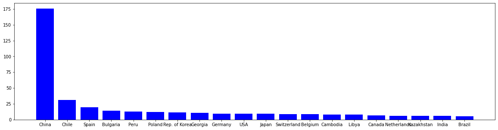
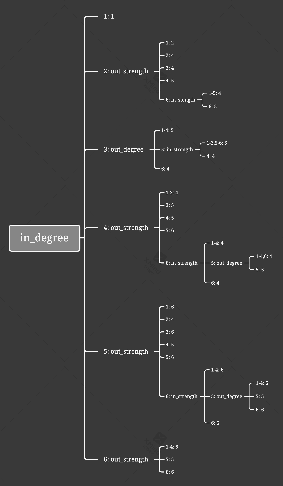

## 1. 数据处理和分析

### 1.1 数据预处理

读取从 [UN Comtrade Database](https://comtrade.un.org/data/) 获取的 2019 年全球铜及其精炼物（2603）贸易记录，并处理：

1. 去除贸易对象为 World 的数据行
2. 并保留关心的数据列：报告者及其代码、贸易对象及代码、贸易类型、贸易额

**！注**：数据中上报者（Reporter）可能包含国家和地区以及**中国**港澳台地区，为方便起见以下统称“国家”.


```python
from src.main import *

data_overview()
```


<div>
<style scoped>
    .dataframe tbody tr th:only-of-type {
        vertical-align: middle;
    }

    .dataframe tbody tr th {
        vertical-align: top;
    }

    .dataframe thead th {
        text-align: right;
    }
</style>
<table border="1" class="dataframe">
  <thead>
    <tr style="text-align: right;">
      <th></th>
      <th>Reporter Code</th>
      <th>Reporter</th>
      <th>Partner Code</th>
      <th>Partner</th>
      <th>Trade Flow</th>
      <th>Trade Value (US$)</th>
    </tr>
  </thead>
  <tbody>
    <tr>
      <th>2</th>
      <td>31</td>
      <td>Azerbaijan</td>
      <td>702</td>
      <td>Singapore</td>
      <td>Export</td>
      <td>419159</td>
    </tr>
    <tr>
      <th>3</th>
      <td>31</td>
      <td>Azerbaijan</td>
      <td>757</td>
      <td>Switzerland</td>
      <td>Export</td>
      <td>3043343</td>
    </tr>
    <tr>
      <th>4</th>
      <td>31</td>
      <td>Azerbaijan</td>
      <td>826</td>
      <td>United Kingdom</td>
      <td>Import</td>
      <td>79</td>
    </tr>
    <tr>
      <th>5</th>
      <td>31</td>
      <td>Azerbaijan</td>
      <td>860</td>
      <td>Uzbekistan</td>
      <td>Export</td>
      <td>17248944</td>
    </tr>
    <tr>
      <th>6</th>
      <td>31</td>
      <td>Azerbaijan</td>
      <td>899</td>
      <td>Areas, nes</td>
      <td>Import</td>
      <td>1007</td>
    </tr>
    <tr>
      <th>...</th>
      <td>...</td>
      <td>...</td>
      <td>...</td>
      <td>...</td>
      <td>...</td>
      <td>...</td>
    </tr>
    <tr>
      <th>1146</th>
      <td>682</td>
      <td>Saudi Arabia</td>
      <td>699</td>
      <td>India</td>
      <td>Export</td>
      <td>119513031</td>
    </tr>
    <tr>
      <th>1147</th>
      <td>682</td>
      <td>Saudi Arabia</td>
      <td>784</td>
      <td>United Arab Emirates</td>
      <td>Import</td>
      <td>133847</td>
    </tr>
    <tr>
      <th>1148</th>
      <td>682</td>
      <td>Saudi Arabia</td>
      <td>842</td>
      <td>USA</td>
      <td>Import</td>
      <td>678083</td>
    </tr>
    <tr>
      <th>1150</th>
      <td>804</td>
      <td>Ukraine</td>
      <td>156</td>
      <td>China</td>
      <td>Import</td>
      <td>3199</td>
    </tr>
    <tr>
      <th>1152</th>
      <td>818</td>
      <td>Egypt</td>
      <td>682</td>
      <td>Saudi Arabia</td>
      <td>Export</td>
      <td>1039</td>
    </tr>
  </tbody>
</table>
<p>998 rows × 6 columns</p>
</div>


### 1.2 数据分析与检验

1. 获取贸易参与者


```python
check_data()
```

    上报进贸易记录的国家总数（不含重复）:  89
    上报进贸易记录的中的贸易对象国家总数（不含重复）:  109
    上报进贸易记录的国家，和记录中的贸易对象国家总数（不含重复）:  119


2. 数据检验

从上面数据可以看出，各国上报的记录显然是有出入的，即上报记录中涉及的国家数要比上报数据的国家数多，这至少说明了一些参与了贸易的国家没有上报贸易记录

下面以中国上报的记录为例检查和说明：

        1. 查看中国上报的进口记录


```python
view_logs_by_china()
```

    中国上报的进口记录中，涉及出口国家的个数:  56


<div>
<style scoped>
    .dataframe tbody tr th:only-of-type {
        vertical-align: middle;
    }

    .dataframe tbody tr th {
        vertical-align: top;
    }

    .dataframe thead th {
        text-align: right;
    }
</style>
<table border="1" class="dataframe">
  <thead>
    <tr style="text-align: right;">
      <th></th>
      <th>Reporter Code</th>
      <th>Reporter</th>
      <th>Partner Code</th>
      <th>Partner</th>
      <th>Trade Flow</th>
      <th>Trade Value (US$)</th>
    </tr>
  </thead>
  <tbody>
    <tr>
      <th>247</th>
      <td>156</td>
      <td>China</td>
      <td>8</td>
      <td>Albania</td>
      <td>Import</td>
      <td>17013004</td>
    </tr>
    <tr>
      <th>248</th>
      <td>156</td>
      <td>China</td>
      <td>36</td>
      <td>Australia</td>
      <td>Import</td>
      <td>1666113958</td>
    </tr>
    <tr>
      <th>250</th>
      <td>156</td>
      <td>China</td>
      <td>51</td>
      <td>Armenia</td>
      <td>Import</td>
      <td>510563982</td>
    </tr>
    <tr>
      <th>251</th>
      <td>156</td>
      <td>China</td>
      <td>68</td>
      <td>Bolivia (Plurinational State of)</td>
      <td>Import</td>
      <td>2677980</td>
    </tr>
    <tr>
      <th>252</th>
      <td>156</td>
      <td>China</td>
      <td>76</td>
      <td>Brazil</td>
      <td>Import</td>
      <td>557705819</td>
    </tr>
    <tr>
      <th>255</th>
      <td>156</td>
      <td>China</td>
      <td>100</td>
      <td>Bulgaria</td>
      <td>Import</td>
      <td>50</td>
    </tr>
    <tr>
      <th>256</th>
      <td>156</td>
      <td>China</td>
      <td>104</td>
      <td>Myanmar</td>
      <td>Import</td>
      <td>2850825</td>
    </tr>
    <tr>
      <th>258</th>
      <td>156</td>
      <td>China</td>
      <td>124</td>
      <td>Canada</td>
      <td>Import</td>
      <td>910149220</td>
    </tr>
    <tr>
      <th>260</th>
      <td>156</td>
      <td>China</td>
      <td>152</td>
      <td>Chile</td>
      <td>Import</td>
      <td>12076025483</td>
    </tr>
    <tr>
      <th>261</th>
      <td>156</td>
      <td>China</td>
      <td>170</td>
      <td>Colombia</td>
      <td>Import</td>
      <td>56382455</td>
    </tr>
    <tr>
      <th>262</th>
      <td>156</td>
      <td>China</td>
      <td>178</td>
      <td>Congo</td>
      <td>Import</td>
      <td>520238</td>
    </tr>
    <tr>
      <th>263</th>
      <td>156</td>
      <td>China</td>
      <td>180</td>
      <td>Dem. Rep. of the Congo</td>
      <td>Import</td>
      <td>386995691</td>
    </tr>
    <tr>
      <th>265</th>
      <td>156</td>
      <td>China</td>
      <td>212</td>
      <td>Dominica</td>
      <td>Import</td>
      <td>57</td>
    </tr>
    <tr>
      <th>266</th>
      <td>156</td>
      <td>China</td>
      <td>214</td>
      <td>Dominican Rep.</td>
      <td>Import</td>
      <td>123783836</td>
    </tr>
    <tr>
      <th>267</th>
      <td>156</td>
      <td>China</td>
      <td>218</td>
      <td>Ecuador</td>
      <td>Import</td>
      <td>4952430</td>
    </tr>
    <tr>
      <th>268</th>
      <td>156</td>
      <td>China</td>
      <td>231</td>
      <td>Ethiopia</td>
      <td>Import</td>
      <td>10326</td>
    </tr>
    <tr>
      <th>269</th>
      <td>156</td>
      <td>China</td>
      <td>232</td>
      <td>Eritrea</td>
      <td>Import</td>
      <td>105319016</td>
    </tr>
    <tr>
      <th>271</th>
      <td>156</td>
      <td>China</td>
      <td>360</td>
      <td>Indonesia</td>
      <td>Import</td>
      <td>618533133</td>
    </tr>
    <tr>
      <th>272</th>
      <td>156</td>
      <td>China</td>
      <td>364</td>
      <td>Iran</td>
      <td>Import</td>
      <td>23701028</td>
    </tr>
    <tr>
      <th>275</th>
      <td>156</td>
      <td>China</td>
      <td>398</td>
      <td>Kazakhstan</td>
      <td>Import</td>
      <td>964109620</td>
    </tr>
    <tr>
      <th>276</th>
      <td>156</td>
      <td>China</td>
      <td>404</td>
      <td>Kenya</td>
      <td>Import</td>
      <td>501479</td>
    </tr>
    <tr>
      <th>278</th>
      <td>156</td>
      <td>China</td>
      <td>410</td>
      <td>Rep. of Korea</td>
      <td>Import</td>
      <td>709</td>
    </tr>
    <tr>
      <th>279</th>
      <td>156</td>
      <td>China</td>
      <td>417</td>
      <td>Kyrgyzstan</td>
      <td>Import</td>
      <td>199725</td>
    </tr>
    <tr>
      <th>280</th>
      <td>156</td>
      <td>China</td>
      <td>418</td>
      <td>Lao People's Dem. Rep.</td>
      <td>Import</td>
      <td>458829040</td>
    </tr>
    <tr>
      <th>281</th>
      <td>156</td>
      <td>China</td>
      <td>450</td>
      <td>Madagascar</td>
      <td>Import</td>
      <td>440772</td>
    </tr>
    <tr>
      <th>282</th>
      <td>156</td>
      <td>China</td>
      <td>458</td>
      <td>Malaysia</td>
      <td>Import</td>
      <td>34683639</td>
    </tr>
    <tr>
      <th>283</th>
      <td>156</td>
      <td>China</td>
      <td>478</td>
      <td>Mauritania</td>
      <td>Import</td>
      <td>209832472</td>
    </tr>
    <tr>
      <th>284</th>
      <td>156</td>
      <td>China</td>
      <td>484</td>
      <td>Mexico</td>
      <td>Import</td>
      <td>1986012762</td>
    </tr>
    <tr>
      <th>285</th>
      <td>156</td>
      <td>China</td>
      <td>490</td>
      <td>Other Asia, nes</td>
      <td>Import</td>
      <td>111136358</td>
    </tr>
    <tr>
      <th>286</th>
      <td>156</td>
      <td>China</td>
      <td>496</td>
      <td>Mongolia</td>
      <td>Import</td>
      <td>1795514292</td>
    </tr>
    <tr>
      <th>287</th>
      <td>156</td>
      <td>China</td>
      <td>504</td>
      <td>Morocco</td>
      <td>Import</td>
      <td>17746697</td>
    </tr>
    <tr>
      <th>288</th>
      <td>156</td>
      <td>China</td>
      <td>508</td>
      <td>Mozambique</td>
      <td>Import</td>
      <td>2099031</td>
    </tr>
    <tr>
      <th>289</th>
      <td>156</td>
      <td>China</td>
      <td>516</td>
      <td>Namibia</td>
      <td>Import</td>
      <td>18079</td>
    </tr>
    <tr>
      <th>290</th>
      <td>156</td>
      <td>China</td>
      <td>566</td>
      <td>Nigeria</td>
      <td>Import</td>
      <td>9853</td>
    </tr>
    <tr>
      <th>292</th>
      <td>156</td>
      <td>China</td>
      <td>586</td>
      <td>Pakistan</td>
      <td>Import</td>
      <td>193330</td>
    </tr>
    <tr>
      <th>293</th>
      <td>156</td>
      <td>China</td>
      <td>591</td>
      <td>Panama</td>
      <td>Import</td>
      <td>387665029</td>
    </tr>
    <tr>
      <th>294</th>
      <td>156</td>
      <td>China</td>
      <td>598</td>
      <td>Papua New Guinea</td>
      <td>Import</td>
      <td>159701250</td>
    </tr>
    <tr>
      <th>295</th>
      <td>156</td>
      <td>China</td>
      <td>604</td>
      <td>Peru</td>
      <td>Import</td>
      <td>9052329871</td>
    </tr>
    <tr>
      <th>296</th>
      <td>156</td>
      <td>China</td>
      <td>608</td>
      <td>Philippines</td>
      <td>Import</td>
      <td>268285022</td>
    </tr>
    <tr>
      <th>297</th>
      <td>156</td>
      <td>China</td>
      <td>642</td>
      <td>Romania</td>
      <td>Import</td>
      <td>12115525</td>
    </tr>
    <tr>
      <th>298</th>
      <td>156</td>
      <td>China</td>
      <td>643</td>
      <td>Russian Federation</td>
      <td>Import</td>
      <td>234860468</td>
    </tr>
    <tr>
      <th>299</th>
      <td>156</td>
      <td>China</td>
      <td>682</td>
      <td>Saudi Arabia</td>
      <td>Import</td>
      <td>152889096</td>
    </tr>
    <tr>
      <th>300</th>
      <td>156</td>
      <td>China</td>
      <td>688</td>
      <td>Serbia</td>
      <td>Import</td>
      <td>111</td>
    </tr>
    <tr>
      <th>301</th>
      <td>156</td>
      <td>China</td>
      <td>699</td>
      <td>India</td>
      <td>Import</td>
      <td>78282781</td>
    </tr>
    <tr>
      <th>302</th>
      <td>156</td>
      <td>China</td>
      <td>704</td>
      <td>Viet Nam</td>
      <td>Import</td>
      <td>22101901</td>
    </tr>
    <tr>
      <th>303</th>
      <td>156</td>
      <td>China</td>
      <td>706</td>
      <td>Somalia</td>
      <td>Import</td>
      <td>154153</td>
    </tr>
    <tr>
      <th>304</th>
      <td>156</td>
      <td>China</td>
      <td>710</td>
      <td>South Africa</td>
      <td>Import</td>
      <td>17009652</td>
    </tr>
    <tr>
      <th>305</th>
      <td>156</td>
      <td>China</td>
      <td>716</td>
      <td>Zimbabwe</td>
      <td>Import</td>
      <td>783889</td>
    </tr>
    <tr>
      <th>306</th>
      <td>156</td>
      <td>China</td>
      <td>724</td>
      <td>Spain</td>
      <td>Import</td>
      <td>872750734</td>
    </tr>
    <tr>
      <th>307</th>
      <td>156</td>
      <td>China</td>
      <td>764</td>
      <td>Thailand</td>
      <td>Import</td>
      <td>115337</td>
    </tr>
    <tr>
      <th>308</th>
      <td>156</td>
      <td>China</td>
      <td>784</td>
      <td>United Arab Emirates</td>
      <td>Import</td>
      <td>70360785</td>
    </tr>
    <tr>
      <th>309</th>
      <td>156</td>
      <td>China</td>
      <td>792</td>
      <td>Turkey</td>
      <td>Import</td>
      <td>60658162</td>
    </tr>
    <tr>
      <th>310</th>
      <td>156</td>
      <td>China</td>
      <td>826</td>
      <td>United Kingdom</td>
      <td>Import</td>
      <td>74307</td>
    </tr>
    <tr>
      <th>311</th>
      <td>156</td>
      <td>China</td>
      <td>834</td>
      <td>United Rep. of Tanzania</td>
      <td>Import</td>
      <td>8523190</td>
    </tr>
    <tr>
      <th>312</th>
      <td>156</td>
      <td>China</td>
      <td>842</td>
      <td>USA</td>
      <td>Import</td>
      <td>13566717</td>
    </tr>
    <tr>
      <th>313</th>
      <td>156</td>
      <td>China</td>
      <td>894</td>
      <td>Zambia</td>
      <td>Import</td>
      <td>23748142</td>
    </tr>
  </tbody>
</table>
</div>


        2. 查看中国进口对象上报的对中国的出口记录


```python
view_logs_about_china()
```

    全球上报了对中国有出口记录的国家 43


<div>
<style scoped>
    .dataframe tbody tr th:only-of-type {
        vertical-align: middle;
    }

    .dataframe tbody tr th {
        vertical-align: top;
    }

    .dataframe thead th {
        text-align: right;
    }
</style>
<table border="1" class="dataframe">
  <thead>
    <tr style="text-align: right;">
      <th></th>
      <th>Reporter Code</th>
      <th>Reporter</th>
      <th>Partner Code</th>
      <th>Partner</th>
      <th>Trade Flow</th>
      <th>Trade Value (US$)</th>
    </tr>
  </thead>
  <tbody>
    <tr>
      <th>13</th>
      <td>36</td>
      <td>Australia</td>
      <td>156</td>
      <td>China</td>
      <td>Export</td>
      <td>1585564428</td>
    </tr>
    <tr>
      <th>36</th>
      <td>51</td>
      <td>Armenia</td>
      <td>156</td>
      <td>China</td>
      <td>Export</td>
      <td>174415305</td>
    </tr>
    <tr>
      <th>68</th>
      <td>68</td>
      <td>Bolivia (Plurinational State of)</td>
      <td>156</td>
      <td>China</td>
      <td>Export</td>
      <td>3882938</td>
    </tr>
    <tr>
      <th>88</th>
      <td>76</td>
      <td>Brazil</td>
      <td>156</td>
      <td>China</td>
      <td>Export</td>
      <td>442971407</td>
    </tr>
    <tr>
      <th>116</th>
      <td>100</td>
      <td>Bulgaria</td>
      <td>156</td>
      <td>China</td>
      <td>Export</td>
      <td>71216190</td>
    </tr>
    <tr>
      <th>161</th>
      <td>124</td>
      <td>Canada</td>
      <td>156</td>
      <td>China</td>
      <td>Export</td>
      <td>764979617</td>
    </tr>
    <tr>
      <th>208</th>
      <td>152</td>
      <td>Chile</td>
      <td>156</td>
      <td>China</td>
      <td>Export</td>
      <td>9649325301</td>
    </tr>
    <tr>
      <th>316</th>
      <td>170</td>
      <td>Colombia</td>
      <td>156</td>
      <td>China</td>
      <td>Export</td>
      <td>40352028</td>
    </tr>
    <tr>
      <th>328</th>
      <td>204</td>
      <td>Benin</td>
      <td>156</td>
      <td>China</td>
      <td>Export</td>
      <td>1708</td>
    </tr>
    <tr>
      <th>334</th>
      <td>218</td>
      <td>Ecuador</td>
      <td>156</td>
      <td>China</td>
      <td>Export</td>
      <td>3562481</td>
    </tr>
    <tr>
      <th>386</th>
      <td>276</td>
      <td>Germany</td>
      <td>156</td>
      <td>China</td>
      <td>Export</td>
      <td>7449316</td>
    </tr>
    <tr>
      <th>416</th>
      <td>344</td>
      <td>China, Hong Kong SAR</td>
      <td>156</td>
      <td>China</td>
      <td>Export</td>
      <td>152061</td>
    </tr>
    <tr>
      <th>427</th>
      <td>360</td>
      <td>Indonesia</td>
      <td>156</td>
      <td>China</td>
      <td>Export</td>
      <td>599729496</td>
    </tr>
    <tr>
      <th>465</th>
      <td>381</td>
      <td>Italy</td>
      <td>156</td>
      <td>China</td>
      <td>Export</td>
      <td>35819</td>
    </tr>
    <tr>
      <th>507</th>
      <td>398</td>
      <td>Kazakhstan</td>
      <td>156</td>
      <td>China</td>
      <td>Export</td>
      <td>738608504</td>
    </tr>
    <tr>
      <th>515</th>
      <td>404</td>
      <td>Kenya</td>
      <td>156</td>
      <td>China</td>
      <td>Export</td>
      <td>15282</td>
    </tr>
    <tr>
      <th>526</th>
      <td>410</td>
      <td>Rep. of Korea</td>
      <td>156</td>
      <td>China</td>
      <td>Export</td>
      <td>260380148</td>
    </tr>
    <tr>
      <th>550</th>
      <td>418</td>
      <td>Lao People's Dem. Rep.</td>
      <td>156</td>
      <td>China</td>
      <td>Export</td>
      <td>589052464</td>
    </tr>
    <tr>
      <th>562</th>
      <td>450</td>
      <td>Madagascar</td>
      <td>156</td>
      <td>China</td>
      <td>Export</td>
      <td>511442</td>
    </tr>
    <tr>
      <th>571</th>
      <td>458</td>
      <td>Malaysia</td>
      <td>156</td>
      <td>China</td>
      <td>Export</td>
      <td>182078771</td>
    </tr>
    <tr>
      <th>600</th>
      <td>490</td>
      <td>Other Asia, nes</td>
      <td>156</td>
      <td>China</td>
      <td>Export</td>
      <td>772507869</td>
    </tr>
    <tr>
      <th>616</th>
      <td>496</td>
      <td>Mongolia</td>
      <td>156</td>
      <td>China</td>
      <td>Export</td>
      <td>1795868367</td>
    </tr>
    <tr>
      <th>621</th>
      <td>504</td>
      <td>Morocco</td>
      <td>156</td>
      <td>China</td>
      <td>Export</td>
      <td>21256334</td>
    </tr>
    <tr>
      <th>635</th>
      <td>516</td>
      <td>Namibia</td>
      <td>156</td>
      <td>China</td>
      <td>Export</td>
      <td>2991391</td>
    </tr>
    <tr>
      <th>685</th>
      <td>586</td>
      <td>Pakistan</td>
      <td>156</td>
      <td>China</td>
      <td>Export</td>
      <td>314633</td>
    </tr>
    <tr>
      <th>700</th>
      <td>604</td>
      <td>Peru</td>
      <td>156</td>
      <td>China</td>
      <td>Export</td>
      <td>8318062306</td>
    </tr>
    <tr>
      <th>731</th>
      <td>608</td>
      <td>Philippines</td>
      <td>156</td>
      <td>China</td>
      <td>Export</td>
      <td>242323556</td>
    </tr>
    <tr>
      <th>780</th>
      <td>643</td>
      <td>Russian Federation</td>
      <td>156</td>
      <td>China</td>
      <td>Export</td>
      <td>224055289</td>
    </tr>
    <tr>
      <th>793</th>
      <td>688</td>
      <td>Serbia</td>
      <td>156</td>
      <td>China</td>
      <td>Export</td>
      <td>41</td>
    </tr>
    <tr>
      <th>805</th>
      <td>699</td>
      <td>India</td>
      <td>156</td>
      <td>China</td>
      <td>Export</td>
      <td>293533475</td>
    </tr>
    <tr>
      <th>835</th>
      <td>704</td>
      <td>Viet Nam</td>
      <td>156</td>
      <td>China</td>
      <td>Export</td>
      <td>71467</td>
    </tr>
    <tr>
      <th>854</th>
      <td>710</td>
      <td>South Africa</td>
      <td>156</td>
      <td>China</td>
      <td>Export</td>
      <td>31830175</td>
    </tr>
    <tr>
      <th>896</th>
      <td>724</td>
      <td>Spain</td>
      <td>156</td>
      <td>China</td>
      <td>Export</td>
      <td>746141115</td>
    </tr>
    <tr>
      <th>980</th>
      <td>792</td>
      <td>Turkey</td>
      <td>156</td>
      <td>China</td>
      <td>Export</td>
      <td>76043743</td>
    </tr>
    <tr>
      <th>1028</th>
      <td>842</td>
      <td>USA</td>
      <td>156</td>
      <td>China</td>
      <td>Export</td>
      <td>4248920</td>
    </tr>
    <tr>
      <th>1069</th>
      <td>894</td>
      <td>Zambia</td>
      <td>156</td>
      <td>China</td>
      <td>Export</td>
      <td>1657677</td>
    </tr>
    <tr>
      <th>1086</th>
      <td>180</td>
      <td>Dem. Rep. of the Congo</td>
      <td>156</td>
      <td>China</td>
      <td>Export</td>
      <td>566480615</td>
    </tr>
    <tr>
      <th>1106</th>
      <td>268</td>
      <td>Georgia</td>
      <td>156</td>
      <td>China</td>
      <td>Export</td>
      <td>171641028</td>
    </tr>
    <tr>
      <th>1122</th>
      <td>478</td>
      <td>Mauritania</td>
      <td>156</td>
      <td>China</td>
      <td>Export</td>
      <td>195646154</td>
    </tr>
    <tr>
      <th>1129</th>
      <td>484</td>
      <td>Mexico</td>
      <td>156</td>
      <td>China</td>
      <td>Export</td>
      <td>2067770798</td>
    </tr>
    <tr>
      <th>1142</th>
      <td>682</td>
      <td>Saudi Arabia</td>
      <td>156</td>
      <td>China</td>
      <td>Export</td>
      <td>135065597</td>
    </tr>
    <tr>
      <th>636</th>
      <td>516</td>
      <td>Namibia</td>
      <td>156</td>
      <td>China</td>
      <td>Re-Export</td>
      <td>2973160</td>
    </tr>
    <tr>
      <th>1107</th>
      <td>268</td>
      <td>Georgia</td>
      <td>156</td>
      <td>China</td>
      <td>Re-Export</td>
      <td>65397569</td>
    </tr>
  </tbody>
</table>
</div>


对比上面两个表格，显然各国出入口数据是**普遍**有出入的：

首先，进出口对象数量上就不一致：中国上报记录中显示，中国 2019 年共从 56 个国家进口铜资源；而只有 43 个国家上报了对中国出口铜资源的记录

其次，对于有些进出口双方都上报了记录的情况，双方上报的贸易金额不一致，有的甚至出入较大

这可能是有以下的原因导致的：

1. 由于政策和统计方法不同导致的上报数据的结果不同. 
2. 由于货物在进出口过程中经第三方国家中转，而进出口国家对于出入口的目标国家登记不一致导致.
3. 其他可能原因.

## 2. 构建网络

根据以上数据和分析，构建网络：

1. 以国家为节点，进出口关系为指向（出口国 -> 进口国），构建有向无权图

2. 对于进出口关系，忽略各个国家之间上报数据的差异，即只要在任何一条记录中出现进出口关系即双方存在贸易关系，则为对应节点添加连边

绘制网络：


```python
# net.draw()
```

## 3. 基于连接信息熵的节点重要性

### 3.1 定义

#### 3.1.1 连接度 $A_i$
定义有向加权网络中节点的连接度为
$$
A_i = \theta\sum_{j\in \Gamma_{i\_in}}k_j + (1-\theta)\sum_{j\in \Gamma_{i\_out}}k_j
$$

其中 $\Gamma_{i\_in}$ 是指向节点 $i$ 的邻居节点集，$\Gamma_{i\_out}$ 是由节点 $i$ 指向的邻居节点集；$k_j$ 是对应节点的度；$\theta \in [0,1]$ 是参数.

具体地，有向加权网络中，定义节点 $k_j$ 的度为：

$$
\begin{aligned}
k_j &= \lambda k_i^{in} + (1-\lambda)k_i^{out} \\
    &= \lambda \sum_{i=1}^m w_{ij} + (1 - \lambda)\sum_{i=1}^m w_{ji}
\end{aligned}
$$

其中 $w_{uv}$ 表示由节点 $u$ 指向节点 $v$ 的边的权重，若该边不存在则记为 $0$；$\lambda$ 为出入边的权重参数.

具体地上式表示，在节点 $j$ 与其邻居节点的连边中，按权重求出入连边的权重和.

#### 3.1.2 连边概率 $P_{i_j}$

定义连边概率 $P_{i_j}$ 为节点 $i$ 被其邻居节点 $j$ 选择进行连边的概率：
$$
P_{i_j} = \frac{k_i}{A_j}, \ \ \ \ (j\in\Gamma_i)
$$

#### 3.1.3 连接信息熵 $E_i$

定义有向网络中连接信息熵如下：

$$
E_i = \sum\limits_{j\in\Gamma_j}\left| P_{i_j}\log_2 P_{i_j} \right|
$$

*这里取绝对值是因为 $\theta$ 加权的原因，$P_{i_j}$ 可能大于 $1$*

## 4. 实验和结果

### 4.1 求各节点的连接信息熵
根据第 3 节给出的定义，求各节点的连接信息熵，并将前 20 的连接信息熵绘图如下：


```python
net.drawEntropiesBar()
```


    

    


### 4.2 层次聚类
对个节点的信息熵进行层次聚类，选择聚类数为 6；并为每个节点设置聚类标签，按熵值从大到小标记为 1 - 6


```python
nodes = net.getSortedEntropies()

Es_clusters, nodes = cluster_nodes(nodes, "E", "label", 6)
```


```python
show_cluster_list(nodes, "label")
```


<div>
<style scoped>
    .dataframe tbody tr th:only-of-type {
        vertical-align: middle;
    }

    .dataframe tbody tr th {
        vertical-align: top;
    }

    .dataframe thead th {
        text-align: right;
    }
</style>
<table border="1" class="dataframe">
  <thead>
    <tr style="text-align: right;">
      <th></th>
      <th>code</th>
      <th>name</th>
    </tr>
    <tr>
      <th>label</th>
      <th></th>
      <th></th>
    </tr>
  </thead>
  <tbody>
    <tr>
      <th>1</th>
      <td>156</td>
      <td>China</td>
    </tr>
    <tr>
      <th>2</th>
      <td>152</td>
      <td>Chile</td>
    </tr>
    <tr>
      <th>3</th>
      <td>724</td>
      <td>Spain</td>
    </tr>
    <tr>
      <th>4</th>
      <td>100,604,616,410,268,276,842,392,757,56,116,434</td>
      <td>Bulgaria,Peru,Poland,Rep. of Korea,Georgia,Ger...</td>
    </tr>
    <tr>
      <th>5</th>
      <td>124,528,398,699,76,36,484,490,894,710,516,246,458</td>
      <td>Canada,Netherlands,Kazakhstan,India,Brazil,Aus...</td>
    </tr>
    <tr>
      <th>6</th>
      <td>608,752,360,643,381,51,688,826,792,180,642,860...</td>
      <td>Philippines,Sweden,Indonesia,Russian Federatio...</td>
    </tr>
  </tbody>
</table>
</div>


### 4.3 选取属性并进行离散化划分

选取以下属性，并选择聚类层数：

* in_degree：入度, 6 层
* out_degree: 出度，6 层
* in_strength: 入强度，6 层
* out_strength: 出强度，6 层

属性值由大到小标记为 1-6


```python
cluster_attributes = [{
  "name": "in_degree",
  "layer": 6,
}, {
  "name": "out_degree",
  "layer": 6,
}, {
  "name": "in_strength",
  "layer": 6,
}, {
  "name": "out_strength",
  "layer": 6,
}]
```


```python
nodes = set_attributes(nodes)
_, nodes = cluster_nodes(nodes, "in_degree", "in_degree", 6)
_, nodes = cluster_nodes(nodes, "out_degree", "out_degree", 6)
_, nodes = cluster_nodes(nodes, "in_strength", "in_strength", 6)
_, nodes = cluster_nodes(nodes, "out_strength", "out_strength", 6)

show_nodes_attribute(nodes)
```

### 4.5 生成决策树

使用 ID3 算法生成决策树


```python
decision_tree = generate_Decision_Tree(nodes)
show_dt_accuracy(nodes, decision_tree)
```

    决策树的正确率： 93.27731092436974 %


决策树简图如下：


根据决策树生成决策表：


```python
a = ID3.generateList(decision_tree)
a = pd.DataFrame(a)
a = a[['in_degree', 'out_strength', 'in_strength', 'out_degree', 'label']].drop_duplicates()
pd.set_option('display.max_rows', None)
print(a.reset_index(drop=True))
```

        in_degree  out_strength  in_strength  out_degree  label
    0           1           NaN          NaN         NaN      1
    1           2           1.0          NaN         NaN      2
    2           2           2.0          NaN         NaN      4
    3           2           3.0          NaN         NaN      4
    4           2           4.0          NaN         NaN      5
    5           2           5.0          NaN         NaN      3
    6           2           6.0          1.0         NaN      4
    7           2           6.0          2.0         NaN      4
    8           2           6.0          3.0         NaN      4
    9           2           6.0          4.0         NaN      4
    10          2           6.0          5.0         NaN      4
    11          2           6.0          6.0         NaN      5
    12          3           NaN          NaN         1.0      5
    13          3           NaN          NaN         2.0      5
    14          3           NaN          NaN         3.0      5
    15          3           NaN          NaN         4.0      5
    16          3           NaN          1.0         5.0      5
    17          3           NaN          2.0         5.0      5
    18          3           NaN          3.0         5.0      5
    19          3           NaN          4.0         5.0      4
    20          3           NaN          5.0         5.0      5
    21          3           NaN          6.0         5.0      5
    22          3           NaN          NaN         6.0      4
    23          4           1.0          NaN         NaN      4
    24          4           2.0          NaN         NaN      4
    25          4           3.0          NaN         NaN      5
    26          4           4.0          NaN         NaN      4
    27          4           5.0          NaN         NaN      6
    28          4           6.0          1.0         NaN      4
    29          4           6.0          2.0         NaN      4
    30          4           6.0          3.0         NaN      4
    31          4           6.0          4.0         NaN      4
    32          4           6.0          5.0         1.0      4
    33          4           6.0          5.0         2.0      4
    34          4           6.0          5.0         3.0      4
    35          4           6.0          5.0         4.0      4
    36          4           6.0          5.0         5.0      5
    37          4           6.0          5.0         6.0      4
    38          4           6.0          6.0         1.0      4
    39          4           6.0          6.0         2.0      4
    40          4           6.0          6.0         3.0      4
    41          4           6.0          6.0         4.0      4
    42          4           6.0          6.0         5.0      4
    43          4           6.0          6.0         6.0      4
    44          5           1.0          NaN         NaN      6
    45          5           2.0          NaN         NaN      4
    46          5           3.0          NaN         NaN      6
    47          5           4.0          NaN         NaN      5
    48          5           5.0          NaN         NaN      6
    49          5           6.0          1.0         NaN      6
    50          5           6.0          2.0         NaN      6
    51          5           6.0          3.0         NaN      6
    52          5           6.0          4.0         NaN      6
    53          5           6.0          5.0         1.0      6
    54          5           6.0          5.0         2.0      6
    55          5           6.0          5.0         3.0      6
    56          5           6.0          5.0         4.0      6
    57          5           6.0          5.0         5.0      5
    58          5           6.0          5.0         6.0      6
    59          5           6.0          6.0         NaN      6
    60          6           1.0          NaN         NaN      6
    61          6           2.0          NaN         NaN      6
    62          6           3.0          NaN         NaN      6
    63          6           4.0          NaN         NaN      6
    64          6           5.0          NaN         NaN      5
    65          6           6.0          NaN         1.0      6
    66          6           6.0          NaN         2.0      6
    67          6           6.0          NaN         3.0      6
    68          6           6.0          NaN         4.0      6
    69          6           6.0          NaN         5.0      6
    70          6           6.0          NaN         6.0      6


## 5. 层次风险模型


